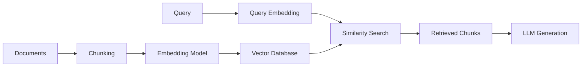

# Vector Embeddings for RAG: Complete Guide 🚀
*From Basic Understanding to Advanced Implementation*

---

## 📚 **Table of Contents**

1. [Fundamentals of Vector Embeddings](#fundamentals)
2. [How Embeddings Work in RAG](#rag-integration)
3. [Types of Embedding Models](#embedding-models)
4. [Embedding Model Comparison](#model-comparison)
5. [Distance Metrics & Similarity](#distance-metrics)
6. [Advanced Embedding Techniques](#advanced-techniques)
7. [Implementation Examples](#implementation)
8. [Best Practices & Optimization](#best-practices)

---

## 🎯 **1. Fundamentals of Vector Embeddings** {#fundamentals}

### **What are Vector Embeddings?**

Vector embeddings are **numerical representations** of text, images, or other data types in a high-dimensional space. They capture semantic meaning and relationships between different pieces of content.

```python
# Example: Text to Vector
text = "The cat sat on the mat"
embedding = [0.1, -0.3, 0.7, 0.2, ...]  # 768-dimensional vector
```

### **Key Concepts**

#### **1. Dimensionality**
- **Low Dimensions (128-384)**: Faster processing, less storage
- **High Dimensions (768-1536)**: Better semantic capture, more accurate
- **Trade-off**: Performance vs. Quality

#### **2. Semantic Similarity**
```python
# Similar concepts have similar vectors
"dog" → [0.2, 0.8, -0.1, ...]
"puppy" → [0.3, 0.7, -0.2, ...]  # Close in vector space
"car" → [-0.5, 0.1, 0.9, ...]   # Far from dog/puppy
```

#### **3. Vector Space Properties**
- **Dense Vectors**: Most values are non-zero
- **Normalized**: Often unit vectors (length = 1)
- **Continuous**: Smooth transitions between concepts

### **Why Embeddings Matter for RAG**

1. **Semantic Search**: Find conceptually similar content, not just keyword matches
2. **Context Understanding**: Capture meaning beyond exact word matching
3. **Multilingual Support**: Cross-language semantic understanding
4. **Scalability**: Efficient similarity computation at scale

---

## 🔗 **2. How Embeddings Work in RAG** {#rag-integration}

### **RAG Pipeline with Embeddings**



### **Step-by-Step Process**

#### **1. Document Processing**
```python
# Document chunking and embedding
chunks = ["Chunk 1 text...", "Chunk 2 text...", ...]
embeddings = embedding_model.encode(chunks)
# Store in vector database
vector_db.store(chunks, embeddings)
```

#### **2. Query Processing**
```python
# Query embedding and retrieval
query = "What is machine learning?"
query_embedding = embedding_model.encode(query)
similar_chunks = vector_db.search(query_embedding, top_k=5)
```

#### **3. Context Generation**
```python
# Combine retrieved chunks for LLM
context = "\n".join([chunk.text for chunk in similar_chunks])
prompt = f"Context: {context}\nQuestion: {query}\nAnswer:"
response = llm.generate(prompt)
```

### **Embedding Quality Impact**

| Embedding Quality | RAG Performance |
|------------------|-----------------|
| **High Quality** | Accurate retrieval, relevant context |
| **Medium Quality** | Some irrelevant results, decent performance |
| **Low Quality** | Poor retrieval, hallucinations |

---

## 🤖 **3. Types of Embedding Models** {#embedding-models}

### **A. General-Purpose Models**

#### **1. OpenAI Embeddings**
```python
# OpenAI text-embedding-3-large
model = "text-embedding-3-large"
dimensions = 3072  # Configurable: 256-3072
use_case = "General purpose, high quality"
cost = "$0.00013 per 1K tokens"
```

**Characteristics:**
- ✅ High quality across domains
- ✅ Configurable dimensions
- ❌ Proprietary, API-dependent
- ❌ Cost per usage

#### **2. Sentence Transformers**
```python
# Popular open-source models
models = {
    "all-mpnet-base-v2": {
        "dimensions": 768,
        "performance": "High",
        "speed": "Medium"
    },
    "all-MiniLM-L6-v2": {
        "dimensions": 384,
        "performance": "Good",
        "speed": "Fast"
    }
}
```

**Characteristics:**
- ✅ Open source, free
- ✅ Local deployment
- ✅ Wide variety of models
- ❌ May need fine-tuning for specific domains

### **B. Specialized Models**

#### **1. Domain-Specific Models**

**Medical/Healthcare:**
```python
models = [
    "microsoft/BiomedNLP-PubMedBERT-base-uncased-abstract",
    "dmis-lab/biobert-base-cased-v1.1",
    "allenai/scibert_scivocab_uncased"
]
```

**Legal:**
```python
models = [
    "nlpaueb/legal-bert-base-uncased",
    "law-ai/InLegalBERT"
]
```

**Financial:**
```python
models = [
    "ProsusAI/finbert",
    "yiyanghkust/finbert-tone"
]
```

#### **2. Multilingual Models**

```python
multilingual_models = {
    "sentence-transformers/paraphrase-multilingual-mpnet-base-v2": {
        "languages": "50+ languages",
        "dimensions": 768,
        "use_case": "Cross-lingual retrieval"
    },
    "intfloat/multilingual-e5-large": {
        "languages": "100+ languages",
        "dimensions": 1024,
        "performance": "State-of-the-art"
    }
}
```

### **C. Latest State-of-the-Art Models**

#### **1. MTEB Leaderboard Top Performers (2025)**

```python
top_models = {
    "nvidia/NV-Embed-v1": {
        "dimensions": 4096,
        "mteb_score": 69.32,
        "specialty": "General purpose, top performer"
    },
    "Salesforce/SFR-Embedding-2_R": {
        "dimensions": 4096,
        "mteb_score": 68.47,
        "specialty": "Retrieval optimized"
    },
    "mixedbread-ai/mxbai-embed-large-v1": {
        "dimensions": 1024,
        "mteb_score": 64.68,
        "specialty": "Balanced performance/size"
    }
}
```

#### **2. Specialized High-Performance Models**

**BGE (Beijing Academy of AI):**
```python
bge_models = {
    "BAAI/bge-large-en-v1.5": {
        "dimensions": 1024,
        "specialty": "English retrieval",
        "performance": "Excellent"
    },
    "BAAI/bge-m3": {
        "dimensions": 1024,
        "specialty": "Multilingual + multi-modal",
        "features": ["dense", "sparse", "multi-vector"]
    }
}
```

---

## 📊 **4. Embedding Model Comparison** {#model-comparison}

### **Performance Benchmarks (MTEB Leaderboard)**

| Model | Dimensions | MTEB Score | Speed | Memory | Use Case |
|-------|------------|------------|-------|---------|----------|
| **nvidia/NV-Embed-v1** | 4096 | 69.32 | Slow | High | Best quality |
| **OpenAI text-embedding-3-large** | 3072 | 64.59 | Medium | Medium | General purpose |
| **mixedbread-ai/mxbai-embed-large** | 1024 | 64.68 | Fast | Medium | Balanced |
| **all-mpnet-base-v2** | 768 | 57.78 | Fast | Low | Local deployment |
| **all-MiniLM-L6-v2** | 384 | 56.26 | Very Fast | Very Low | Resource constrained |

### **Detailed Model Analysis**

#### **1. OpenAI Models**
```python
openai_models = {
    "text-embedding-3-large": {
        "pros": [
            "Highest quality for general use",
            "Configurable dimensions",
            "Excellent multilingual support",
            "Regular updates"
        ],
        "cons": [
            "API dependency",
            "Usage costs",
            "Rate limits",
            "No local deployment"
        ],
        "best_for": "Production apps with budget"
    },
    "text-embedding-3-small": {
        "dimensions": 1536,
        "cost": "$0.00002 per 1K tokens",
        "performance": "Good balance of cost/quality"
    }
}
```

#### **2. Sentence Transformers**
```python
sentence_transformers = {
    "all-mpnet-base-v2": {
        "pros": [
            "Free and open source",
            "Local deployment",
            "Good general performance",
            "Active community"
        ],
        "cons": [
            "May need domain fine-tuning",
            "Lower performance than latest models",
            "Limited multilingual support"
        ],
        "best_for": "Local deployment, cost-sensitive projects"
    }
}
```

#### **3. Specialized Models**
```python
specialized_comparison = {
    "domain_specific": {
        "when_to_use": "Domain vocabulary is critical",
        "examples": ["Medical terms", "Legal jargon", "Technical specs"],
        "performance_gain": "10-30% improvement in domain"
    },
    "multilingual": {
        "when_to_use": "Cross-language retrieval needed",
        "examples": ["Global documentation", "Multi-language support"],
        "trade_offs": "Slightly lower monolingual performance"
    }
}
```

---

## 📏 **5. Distance Metrics & Similarity** {#distance-metrics}

### **Common Similarity Metrics**

#### **1. Cosine Similarity** ⭐ *Most Popular*
```python
import numpy as np

def cosine_similarity(a, b):
    return np.dot(a, b) / (np.linalg.norm(a) * np.linalg.norm(b))

# Example
vec1 = [1, 2, 3]
vec2 = [2, 4, 6]
similarity = cosine_similarity(vec1, vec2)  # = 1.0 (identical direction)
```

**Characteristics:**
- ✅ Measures angle between vectors (direction)
- ✅ Normalized (0 to 1 range)
- ✅ Robust to vector magnitude differences
- ✅ Most common for text embeddings

#### **2. Dot Product**
```python
def dot_product_similarity(a, b):
    return np.dot(a, b)

# Considers both direction and magnitude
# Higher values = more similar
```

**When to Use:**
- Embeddings are already normalized
- Want to consider vector magnitude
- Faster computation than cosine

#### **3. Euclidean Distance (L2)**
```python
def euclidean_distance(a, b):
    return np.linalg.norm(a - b)

# Lower distance = more similar
# Measures straight-line distance in space
```

**Characteristics:**
- Measures absolute distance in space
- Sensitive to vector magnitude
- Good for spatial relationships

#### **4. Manhattan Distance (L1)**
```python
def manhattan_distance(a, b):
    return np.sum(np.abs(a - b))

# Sum of absolute differences
# Less sensitive to outliers than Euclidean
```

### **Choosing the Right Metric**

| Metric | Best For | Embedding Type | Performance |
|--------|----------|----------------|-------------|
| **Cosine** | Text embeddings | Normalized/Unnormalized | Medium |
| **Dot Product** | Normalized embeddings | Pre-normalized | Fast |
| **Euclidean** | Spatial relationships | Dense vectors | Medium |
| **Manhattan** | Outlier-robust | Sparse vectors | Fast |

### **Implementation Examples**

```python
# Vector database configuration
vector_configs = {
    "pinecone": {
        "metric": "cosine",  # Default and recommended
        "dimensions": 1536
    },
    "milvus": {
        "metric_type": "COSINE",  # Also supports IP, L2
        "index_type": "HNSW"
    },
    "chroma": {
        "distance_function": "cosine",  # Default
        "hnsw_space": "cosine"
    }
}
```

---

## 🚀 **6. Advanced Embedding Techniques** {#advanced-techniques}

### **A. Hybrid Retrieval**

#### **1. Dense + Sparse Combination**
```python
# Combine semantic (dense) and keyword (sparse) search
class HybridRetriever:
    def __init__(self, dense_model, sparse_model):
        self.dense = dense_model      # e.g., sentence-transformers
        self.sparse = sparse_model    # e.g., BM25, SPLADE
    
    def retrieve(self, query, alpha=0.7):
        # Dense retrieval
        dense_results = self.dense.search(query)
        
        # Sparse retrieval  
        sparse_results = self.sparse.search(query)
        
        # Combine scores
        combined = self.combine_scores(dense_results, sparse_results, alpha)
        return combined
```

#### **2. Multi-Vector Approaches**
```python
# Different embeddings for different aspects
class MultiVectorRetriever:
    def __init__(self):
        self.semantic_model = SentenceTransformer('all-mpnet-base-v2')
        self.keyword_model = SPLADE()
        self.domain_model = DomainSpecificModel()
    
    def embed_document(self, text):
        return {
            'semantic': self.semantic_model.encode(text),
            'keyword': self.keyword_model.encode(text),
            'domain': self.domain_model.encode(text)
        }
```

### **B. Fine-Tuning Embeddings**

#### **1. Domain Adaptation**
```python
# Fine-tune for specific domain
from sentence_transformers import SentenceTransformer, InputExample, losses

# Load base model
model = SentenceTransformer('all-mpnet-base-v2')

# Prepare domain-specific training data
train_examples = [
    InputExample(texts=['query', 'relevant_doc'], label=1.0),
    InputExample(texts=['query', 'irrelevant_doc'], label=0.0),
]

# Fine-tune
train_loss = losses.CosineSimilarityLoss(model)
model.fit(train_objectives=[(train_dataloader, train_loss)], epochs=1)
```

#### **2. Contrastive Learning**
```python
# Improve embedding quality through contrastive learning
class ContrastiveLoss:
    def __init__(self, temperature=0.07):
        self.temperature = temperature
    
    def forward(self, anchor, positive, negative):
        # Pull positive pairs together, push negative pairs apart
        pos_sim = cosine_similarity(anchor, positive) / self.temperature
        neg_sim = cosine_similarity(anchor, negative) / self.temperature
        
        loss = -torch.log(torch.exp(pos_sim) / (torch.exp(pos_sim) + torch.exp(neg_sim)))
        return loss
```

### **C. Embedding Optimization**

#### **1. Dimensionality Reduction**
```python
# Reduce embedding dimensions while preserving quality
from sklearn.decomposition import PCA

# Original 768-dim embeddings
embeddings = model.encode(texts)  # Shape: (n_docs, 768)

# Reduce to 256 dimensions
pca = PCA(n_components=256)
reduced_embeddings = pca.fit_transform(embeddings)  # Shape: (n_docs, 256)

# 3x storage reduction with minimal quality loss
```

#### **2. Quantization**
```python
# Reduce memory usage through quantization
import numpy as np

def quantize_embeddings(embeddings, bits=8):
    """Quantize float32 embeddings to int8"""
    # Normalize to [-1, 1] range
    normalized = embeddings / np.max(np.abs(embeddings))
    
    # Quantize to int8
    quantized = (normalized * 127).astype(np.int8)
    
    return quantized  # 4x memory reduction
```

### **D. Contextual Embeddings**

#### **1. Query-Aware Embeddings**
```python
# Adapt embeddings based on query context
class ContextualEmbedder:
    def __init__(self, base_model):
        self.base_model = base_model
        self.context_adapter = ContextAdapter()
    
    def embed_with_context(self, text, query_context):
        base_embedding = self.base_model.encode(text)
        context_embedding = self.context_adapter(base_embedding, query_context)
        return context_embedding
```

#### **2. Hierarchical Embeddings**
```python
# Multi-level embeddings for different granularities
class HierarchicalEmbedder:
    def __init__(self):
        self.sentence_model = SentenceTransformer('all-mpnet-base-v2')
        self.paragraph_model = LongformerEmbedder()
        self.document_model = DocumentEmbedder()
    
    def embed_hierarchical(self, document):
        sentences = split_sentences(document)
        paragraphs = split_paragraphs(document)
        
        return {
            'sentence_embeddings': [self.sentence_model.encode(s) for s in sentences],
            'paragraph_embeddings': [self.paragraph_model.encode(p) for p in paragraphs],
            'document_embedding': self.document_model.encode(document)
        }
```

---

## 💻 **7. Implementation Examples** {#implementation}

### **A. Basic RAG with Different Embedding Models**

#### **1. OpenAI Embeddings**
```python
import openai
from pinecone import Pinecone

class OpenAIRAG:
    def __init__(self, api_key, pinecone_key):
        self.client = openai.OpenAI(api_key=api_key)
        self.pc = Pinecone(api_key=pinecone_key)
        self.index = self.pc.Index("rag-index")
    
    def embed_text(self, text):
        response = self.client.embeddings.create(
            model="text-embedding-3-large",
            input=text,
            dimensions=1536  # Configurable
        )
        return response.data[0].embedding
    
    def add_documents(self, documents):
        for i, doc in enumerate(documents):
            embedding = self.embed_text(doc)
            self.index.upsert([(str(i), embedding, {"text": doc})])
    
    def search(self, query, top_k=5):
        query_embedding = self.embed_text(query)
        results = self.index.query(
            vector=query_embedding,
            top_k=top_k,
            include_metadata=True
        )
        return [match.metadata["text"] for match in results.matches]
```

#### **2. Sentence Transformers (Local)**
```python
from sentence_transformers import SentenceTransformer
import chromadb

class LocalRAG:
    def __init__(self, model_name="all-mpnet-base-v2"):
        self.model = SentenceTransformer(model_name)
        self.client = chromadb.Client()
        self.collection = self.client.create_collection("rag-collection")
    
    def add_documents(self, documents):
        embeddings = self.model.encode(documents)
        ids = [str(i) for i in range(len(documents))]
        
        self.collection.add(
            embeddings=embeddings.tolist(),
            documents=documents,
            ids=ids
        )
    
    def search(self, query, top_k=5):
        query_embedding = self.model.encode([query])
        results = self.collection.query(
            query_embeddings=query_embedding.tolist(),
            n_results=top_k
        )
        return results['documents'][0]
```

### **B. Advanced Multi-Model RAG**

```python
class AdvancedRAG:
    def __init__(self):
        # Multiple embedding models for different purposes
        self.semantic_model = SentenceTransformer('all-mpnet-base-v2')
        self.domain_model = SentenceTransformer('microsoft/BiomedNLP-PubMedBERT-base-uncased-abstract')
        self.multilingual_model = SentenceTransformer('paraphrase-multilingual-mpnet-base-v2')
        
        # Vector databases
        self.semantic_db = ChromaDB("semantic")
        self.domain_db = ChromaDB("domain")
        self.multilingual_db = ChromaDB("multilingual")
    
    def embed_document(self, text, doc_type="general", language="en"):
        embeddings = {}
        
        # Always create semantic embedding
        embeddings['semantic'] = self.semantic_model.encode(text)
        
        # Domain-specific embedding if needed
        if doc_type == "medical":
            embeddings['domain'] = self.domain_model.encode(text)
        
        # Multilingual embedding if non-English
        if language != "en":
            embeddings['multilingual'] = self.multilingual_model.encode(text)
        
        return embeddings
    
    def hybrid_search(self, query, query_type="general", language="en", top_k=5):
        results = []
        
        # Semantic search (always)
        semantic_embedding = self.semantic_model.encode([query])
        semantic_results = self.semantic_db.search(semantic_embedding, top_k)
        results.extend(semantic_results)
        
        # Domain search if applicable
        if query_type == "medical":
            domain_embedding = self.domain_model.encode([query])
            domain_results = self.domain_db.search(domain_embedding, top_k)
            results.extend(domain_results)
        
        # Multilingual search if needed
        if language != "en":
            multilingual_embedding = self.multilingual_model.encode([query])
            multilingual_results = self.multilingual_db.search(multilingual_embedding, top_k)
            results.extend(multilingual_results)
        
        # Deduplicate and rerank
        return self.rerank_results(results, query)
```

### **C. Performance Optimization**

```python
class OptimizedRAG:
    def __init__(self):
        self.model = SentenceTransformer('all-mpnet-base-v2')
        self.embedding_cache = {}
        self.batch_size = 32
    
    def embed_with_cache(self, texts):
        """Cache embeddings to avoid recomputation"""
        new_texts = []
        cached_embeddings = {}
        
        for i, text in enumerate(texts):
            text_hash = hash(text)
            if text_hash in self.embedding_cache:
                cached_embeddings[i] = self.embedding_cache[text_hash]
            else:
                new_texts.append((i, text))
        
        # Compute new embeddings in batches
        if new_texts:
            indices, texts_to_embed = zip(*new_texts)
            new_embeddings = self.model.encode(
                list(texts_to_embed), 
                batch_size=self.batch_size,
                show_progress_bar=True
            )
            
            # Cache new embeddings
            for idx, text, embedding in zip(indices, texts_to_embed, new_embeddings):
                text_hash = hash(text)
                self.embedding_cache[text_hash] = embedding
                cached_embeddings[idx] = embedding
        
        # Return embeddings in original order
        return [cached_embeddings[i] for i in range(len(texts))]
    
    def batch_search(self, queries, top_k=5):
        """Process multiple queries efficiently"""
        query_embeddings = self.model.encode(queries, batch_size=self.batch_size)
        
        results = []
        for query_embedding in query_embeddings:
            search_results = self.vector_db.search(query_embedding, top_k)
            results.append(search_results)
        
        return results
```

---

## ⚡ **8. Best Practices & Optimization** {#best-practices}

### **A. Model Selection Guidelines**

#### **1. Decision Matrix**
```python
def choose_embedding_model(requirements):
    """
    Choose embedding model based on requirements
    """
    if requirements.get('budget') == 'unlimited' and requirements.get('quality') == 'highest':
        return "nvidia/NV-Embed-v1"
    
    elif requirements.get('deployment') == 'local':
        if requirements.get('performance') == 'high':
            return "all-mpnet-base-v2"
        else:
            return "all-MiniLM-L6-v2"
    
    elif requirements.get('multilingual') == True:
        return "intfloat/multilingual-e5-large"
    
    elif requirements.get('domain') in ['medical', 'legal', 'financial']:
        return get_domain_specific_model(requirements.get('domain'))
    
    else:
        return "text-embedding-3-large"  # OpenAI default
```

#### **2. Performance vs. Cost Analysis**
```python
model_analysis = {
    "production_ready": {
        "high_volume": "all-mpnet-base-v2",  # Local, fast
        "high_quality": "text-embedding-3-large",  # API, expensive
        "balanced": "mixedbread-ai/mxbai-embed-large-v1"
    },
    "development": {
        "prototyping": "all-MiniLM-L6-v2",  # Fast, good enough
        "testing": "all-mpnet-base-v2"  # Better quality for validation
    }
}
```

### **B. Optimization Strategies**

#### **1. Embedding Caching**
```python
import hashlib
import pickle
from functools import lru_cache

class EmbeddingCache:
    def __init__(self, cache_size=10000):
        self.cache = {}
        self.max_size = cache_size
    
    def get_cache_key(self, text):
        return hashlib.md5(text.encode()).hexdigest()
    
    @lru_cache(maxsize=10000)
    def get_embedding(self, text):
        cache_key = self.get_cache_key(text)
        
        if cache_key in self.cache:
            return self.cache[cache_key]
        
        # Compute embedding
        embedding = self.model.encode(text)
        
        # Cache with size limit
        if len(self.cache) >= self.max_size:
            # Remove oldest entry
            oldest_key = next(iter(self.cache))
            del self.cache[oldest_key]
        
        self.cache[cache_key] = embedding
        return embedding
```

#### **2. Batch Processing**
```python
class BatchEmbedder:
    def __init__(self, model, batch_size=32):
        self.model = model
        self.batch_size = batch_size
    
    def embed_documents(self, documents):
        """Process documents in batches for efficiency"""
        all_embeddings = []
        
        for i in range(0, len(documents), self.batch_size):
            batch = documents[i:i + self.batch_size]
            batch_embeddings = self.model.encode(
                batch,
                batch_size=len(batch),
                show_progress_bar=True
            )
            all_embeddings.extend(batch_embeddings)
        
        return all_embeddings
```

#### **3. Memory Optimization**
```python
class MemoryOptimizedEmbedder:
    def __init__(self, model_name):
        # Load model with optimizations
        self.model = SentenceTransformer(
            model_name,
            device='cuda' if torch.cuda.is_available() else 'cpu'
        )
        
        # Enable half precision for memory savings
        if torch.cuda.is_available():
            self.model.half()
    
    def embed_large_dataset(self, texts, chunk_size=1000):
        """Process large datasets without memory overflow"""
        embeddings = []
        
        for i in range(0, len(texts), chunk_size):
            chunk = texts[i:i + chunk_size]
            chunk_embeddings = self.model.encode(chunk)
            
            # Convert to half precision and move to CPU
            chunk_embeddings = chunk_embeddings.astype(np.float16)
            embeddings.append(chunk_embeddings)
            
            # Clear GPU memory
            if torch.cuda.is_available():
                torch.cuda.empty_cache()
        
        return np.vstack(embeddings)
```

### **C. Quality Assurance**

#### **1. Embedding Quality Metrics**
```python
def evaluate_embedding_quality(embeddings, labels):
    """Evaluate embedding quality using various metrics"""
    from sklearn.metrics import silhouette_score
    from sklearn.cluster import KMeans
    
    metrics = {}
    
    # Silhouette score (higher is better)
    metrics['silhouette'] = silhouette_score(embeddings, labels)
    
    # Intra-cluster vs inter-cluster distance
    kmeans = KMeans(n_clusters=len(set(labels)))
    cluster_labels = kmeans.fit_predict(embeddings)
    
    intra_distances = []
    inter_distances = []
    
    for i, embedding in enumerate(embeddings):
        same_cluster = embeddings[cluster_labels == cluster_labels[i]]
        diff_cluster = embeddings[cluster_labels != cluster_labels[i]]
        
        if len(same_cluster) > 1:
            intra_dist = np.mean([cosine_distance(embedding, other) 
                                for other in same_cluster if not np.array_equal(embedding, other)])
            intra_distances.append(intra_dist)
        
        if len(diff_cluster) > 0:
            inter_dist = np.mean([cosine_distance(embedding, other) for other in diff_cluster])
            inter_distances.append(inter_dist)
    
    metrics['intra_cluster_distance'] = np.mean(intra_distances)
    metrics['inter_cluster_distance'] = np.mean(inter_distances)
    metrics['separation_ratio'] = metrics['inter_cluster_distance'] / metrics['intra_cluster_distance']
    
    return metrics
```

#### **2. A/B Testing Framework**
```python
class EmbeddingABTest:
    def __init__(self, model_a, model_b, test_queries, ground_truth):
        self.model_a = model_a
        self.model_b = model_b
        self.test_queries = test_queries
        self.ground_truth = ground_truth
    
    def run_test(self):
        results_a = self.evaluate_model(self.model_a)
        results_b = self.evaluate_model(self.model_b)
        
        return {
            'model_a': results_a,
            'model_b': results_b,
            'winner': 'A' if results_a['mrr'] > results_b['mrr'] else 'B',
            'improvement': abs(results_a['mrr'] - results_b['mrr']) / min(results_a['mrr'], results_b['mrr'])
        }
    
    def evaluate_model(self, model):
        total_mrr = 0
        total_precision_at_k = 0
        
        for query, relevant_docs in zip(self.test_queries, self.ground_truth):
            query_embedding = model.encode([query])
            
            # Get top-k results
            results = self.vector_db.search(query_embedding, top_k=10)
            
            # Calculate MRR (Mean Reciprocal Rank)
            for i, result in enumerate(results):
                if result in relevant_docs:
                    total_mrr += 1 / (i + 1)
                    break
            
            # Calculate Precision@K
            relevant_in_results = len(set(results[:5]) & set(relevant_docs))
            total_precision_at_k += relevant_in_results / 5
        
        return {
            'mrr': total_mrr / len(self.test_queries),
            'precision_at_5': total_precision_at_k / len(self.test_queries)
        }
```

### **D. Production Deployment**

#### **1. Monitoring & Alerting**
```python
class EmbeddingMonitor:
    def __init__(self):
        self.metrics = {
            'embedding_latency': [],
            'search_latency': [],
            'cache_hit_rate': 0,
            'error_rate': 0
        }
    
    def log_embedding_time(self, start_time, end_time):
        latency = end_time - start_time
        self.metrics['embedding_latency'].append(latency)
        
        # Alert if latency is too high
        if latency > 1.0:  # 1 second threshold
            self.send_alert(f"High embedding latency: {latency:.2f}s")
    
    def log_search_time(self, start_time, end_time):
        latency = end_time - start_time
        self.metrics['search_latency'].append(latency)
        
        if latency > 0.1:  # 100ms threshold
            self.send_alert(f"High search latency: {latency:.2f}s")
    
    def get_performance_report(self):
        return {
            'avg_embedding_latency': np.mean(self.metrics['embedding_latency']),
            'p95_embedding_latency': np.percentile(self.metrics['embedding_latency'], 95),
            'avg_search_latency': np.mean(self.metrics['search_latency']),
            'cache_hit_rate': self.metrics['cache_hit_rate'],
            'error_rate': self.metrics['error_rate']
        }
```

#### **2. Scaling Strategies**
```python
class ScalableEmbeddingService:
    def __init__(self):
        self.model_pool = ModelPool(size=4)  # Multiple model instances
        self.embedding_queue = Queue()
        self.result_cache = Redis()
    
    async def embed_async(self, texts):
        """Asynchronous embedding with load balancing"""
        tasks = []
        
        for text in texts:
            # Check cache first
            cache_key = f"embed:{hash(text)}"
            cached = await self.result_cache.get(cache_key)
            
            if cached:
                tasks.append(asyncio.create_task(self.return_cached(cached)))
            else:
                tasks.append(asyncio.create_task(self.compute_embedding(text)))
        
        return await asyncio.gather(*tasks)
    
    async def compute_embedding(self, text):
        # Get available model from pool
        model = await self.model_pool.get()
        
        try:
            embedding = model.encode(text)
            
            # Cache result
            cache_key = f"embed:{hash(text)}"
            await self.result_cache.set(cache_key, embedding, expire=3600)
            
            return embedding
        finally:
            # Return model to pool
            await self.model_pool.put(model)
```

---

## 🎯 **Conclusion**

Vector embeddings are the foundation of effective RAG systems. Key takeaways:

### **🔑 Key Principles**
1. **Choose the right model** for your use case and constraints
2. **Optimize for your specific domain** when possible
3. **Monitor performance** and iterate based on real usage
4. **Balance quality vs. cost** based on requirements

### **🚀 Getting Started Recommendations**
1. **Start Simple**: Begin with `all-mpnet-base-v2` for local or `text-embedding-3-large` for API
2. **Measure Everything**: Implement evaluation from day one
3. **Iterate Gradually**: Improve based on actual performance data
4. **Plan for Scale**: Design with production requirements in mind

### **📈 Future Trends**
- **Multimodal embeddings** (text + images + audio)
- **Longer context embeddings** (handling full documents)
- **Domain-specific fine-tuning** becoming more accessible
- **Hybrid approaches** combining multiple embedding types

This comprehensive guide provides the foundation for implementing high-quality vector embeddings in your RAG systems. Start with the basics, measure performance, and gradually incorporate advanced techniques as needed.

---

*Last Updated: January 2025*
*Based on comprehensive research of current embedding technologies and best practices*
